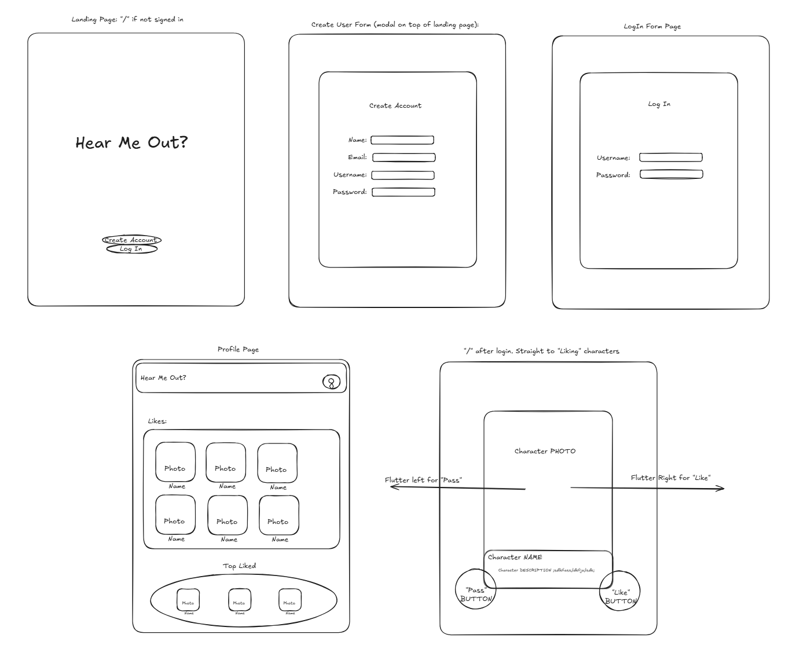

# Flask React Project (Hear Me Out?)

(all resources in "hmo_resources" folder)

# Database Schema


# Hear Me Out? Wireframes



# User Stories
Authentication & User Management
User Login & Signup

As a user, I want to log in or sign up before using the app so that I can access all features.
Profile Management

As a user, I want to view my profile, where I can see all the characters I’ve liked.
Core Swiping Feature
Swipe or Like Characters

As a user, I want to see one character at a time and be able to either like (swipe right) or pass (swipe left) on them.
See Like Count After Swiping

As a user, I want to see how many likes a character has only after I have swiped on them, so that I can engage without being influenced by popularity.
User-Generated Content
Create & Upload Characters

As a user, I want to upload my own characters to the app so that other users can interact with them.
Character Descriptions

As a user, I want to add a 50-character description to each character I upload so that I can provide a quick intro about them.

BONUS Features That Could Enhance the App
Undo Last Swipe (Optional Premium Feature?)

As a user, I want to undo my last swipe in case I made a mistake.
Super Like Feature (Limited per Day?)

As a user, I want to "Super Like" a character, showing that I really like them.
Character Sorting & Filtering

As a user, I want to filter characters by category (e.g., movies, TV shows, anime, comics) so that I can see characters that match my interests.
Character Comment Section

As a user, I want to leave and read comments on characters to discuss with other users.
Would you like to add features like favoriting characters, seeing top-liked characters, or user interactions like comments or discussions?

# MVP Feature List

1. User Authentication:
   - Sign Up and Login: Allow users to create an account and log in
   - Profile Management: Basic user profile with username, avatar and all Liked Characters

2. Character Database:
   - Character Profiles: Create database of unreal characters
   - Character Categories (BONUS): Organize characters by cartoon, gender, movie or TV show

3. Swipe Interface:
   - Swipe Funcitonality: Implement Swipe Left for "Pass" and Swipe Right for "Like"
   - Ransomized Display: Show characters in a ransom order for swiping

4. Tallying Likes:
   - Like Counter: Track and tally the number of likes each character recieves
   - Users should be able to see how many likes a character has, able to like a character, and unlike character from their profile, where they can view all the characters they've liked.
   - Top Characters (BONUS): Display a leaderboard or Top-Liked list

5. Post Characters:
   - Character Submission Form: Users will be able to view other posted characters
   - Form Validation: Unique names only. Same character cannot be uploaded
   - Image upload handling: Image storage and image preview
   - Character Management: Edit/Delete user-owned characters with
   - Character Display: Character gallery of all submitted characters


## Getting started

1. Clone this repository (only this branch).

2. Install dependencies.

   ```bash
   pipenv install -r requirements.txt
   ```

3. Create a __.env__ file based on the example with proper settings for your
   development environment.

4. Make sure the SQLite3 database connection URL is in the __.env__ file.

5. This starter organizes all tables inside the `flask_schema` schema, defined
   by the `SCHEMA` environment variable.  Replace the value for
   `SCHEMA` with a unique name, **making sure you use the snake_case
   convention.**

6. Get into your pipenv, migrate your database, seed your database, and run your
   Flask app:

   ```bash
   pipenv shell
   ```

   ```bash
   flask db upgrade
   ```

   ```bash
   flask seed all
   ```

   ```bash
   flask run
   ```

7. The React frontend has no styling applied. Copy the __.css__ files from your
   Authenticate Me project into the corresponding locations in the
   __react-vite__ folder to give your project a unique look.

8. To run the React frontend in development, `cd` into the __react-vite__
   directory and run `npm i` to install dependencies. Next, run `npm run build`
   to create the `dist` folder. The starter has modified the `npm run build`
   command to include the `--watch` flag. This flag will rebuild the __dist__
   folder whenever you change your code, keeping the production version up to
   date.

## Deployment through Render.com

First, recall that Vite is a development dependency, so it will not be used in
production. This means that you must already have the __dist__ folder located in
the root of your __react-vite__ folder when you push to GitHub. This __dist__
folder contains your React code and all necessary dependencies minified and
bundled into a smaller footprint, ready to be served from your Python API.

Begin deployment by running `npm run build` in your __react-vite__ folder and
pushing any changes to GitHub.

Refer to your Render.com deployment articles for more detailed instructions
about getting started with [Render.com], creating a production database, and
deployment debugging tips.

From the Render [Dashboard], click on the "New +" button in the navigation bar,
and click on "Web Service" to create the application that will be deployed.

Select that you want to "Build and deploy from a Git repository" and click
"Next". On the next page, find the name of the application repo you want to
deploy and click the "Connect" button to the right of the name.

Now you need to fill out the form to configure your app. Most of the setup will
be handled by the __Dockerfile__, but you do need to fill in a few fields.

Start by giving your application a name.

Make sure the Region is set to the location closest to you, the Branch is set to
"main", and Runtime is set to "Docker". You can leave the Root Directory field
blank. (By default, Render will run commands from the root directory.)

Select "Free" as your Instance Type.

### Add environment variables

In the development environment, you have been securing your environment
variables in a __.env__ file, which has been removed from source control (i.e.,
the file is gitignored). In this step, you will need to input the keys and
values for the environment variables you need for production into the Render
GUI.

Add the following keys and values in the Render GUI form:

- SECRET_KEY (click "Generate" to generate a secure secret for production)
- FLASK_ENV production
- FLASK_APP app
- SCHEMA (your unique schema name, in snake_case)

In a new tab, navigate to your dashboard and click on your Postgres database
instance.

Add the following keys and values:

- DATABASE_URL (copy value from the **External Database URL** field)

**Note:** Add any other keys and values that may be present in your local
__.env__ file. As you work to further develop your project, you may need to add
more environment variables to your local __.env__ file. Make sure you add these
environment variables to the Render GUI as well for the next deployment.

### Deploy

Now you are finally ready to deploy! Click "Create Web Service" to deploy your
project. The deployment process will likely take about 10-15 minutes if
everything works as expected. You can monitor the logs to see your Dockerfile
commands being executed and any errors that occur.

When deployment is complete, open your deployed site and check to see that you
have successfully deployed your Flask application to Render! You can find the
URL for your site just below the name of the Web Service at the top of the page.

**Note:** By default, Render will set Auto-Deploy for your project to true. This
setting will cause Render to re-deploy your application every time you push to
main, always keeping it up to date.

[Render.com]: https://render.com/
[Dashboard]: https://dashboard.render.com/
